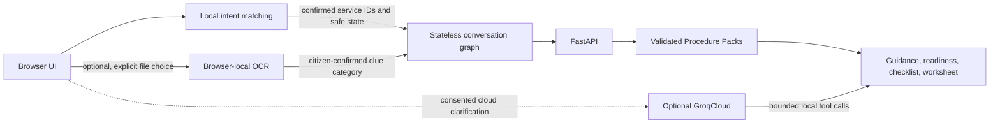

# Architecture

Sahayi combines browser-local service matching with a stateless FastAPI application. Procedure Packs provide the verified facts and rules used by both the guided journey and optional AI tools.

## Browser

The finder combines pack-authored phrases with a bundled character n-gram Naive Bayes model. It proposes only a service in the active catalogue, and the user confirms before the service opens. Finder text stays in browser memory and is not sent to the API.

The primary journey stores conversation and preparation data in React memory. The browser sends service, question, answer-category, completed-field, and confirmed document-clue IDs. Personal field values and document content stay local. The journey clears on Start Over, End Session, language change, navigation, and inactivity expiry.

Optional voice features use browser APIs after an explicit action. Optional document assistance uses pinned, same-origin OCR assets to process supported images and PDFs in the browser. Both features can be unavailable without blocking the text journey.

## API and procedure data

FastAPI serves the production frontend and `/api/v1` from the same origin. Requests are stateless and responses use `Cache-Control: no-store`. The bounded conversation graph validates browser-carried state against the active Procedure Packs on each turn. It has no database, durable session, checkpointer, or telemetry.

Versioned Procedure Packs contain service facts, localized guidance, sources, readiness rules, preparation fields, and official handoff links. Strict validation selects one active version per service. Readiness, checklists, and worksheets are deterministic; freshness and unresolved source conflicts remain visible. A readiness result is procedural guidance, not an eligibility decision.

No official PDF is enabled. The browser creates a watermarked preparation worksheet, and the user reviews it before downloading or printing.

## Optional cloud guidance

GroqCloud guidance is disabled unless the server feature flag and server-side key are configured. It requires explicit user consent and accepts only bounded, screened text. The provider may guide wording and tool order; Sahayi rebuilds facts, sources, actions, and outcomes from local Procedure Pack data. Provider failure falls back to deterministic guidance.

## Source monitoring and runtime

The Procedure Intelligence command compares allowlisted public sources in a bounded one-shot review. It can produce a report for human review; it does not edit or activate procedure facts. The scheduled GitHub workflow is read-only.

The multi-stage Docker build compiles the frontend and installs the API, then serves both from one unprivileged container. See [privacy and safety](privacy-boundary.md) for data boundaries and [deployment](deployment.md) for hosting details.
