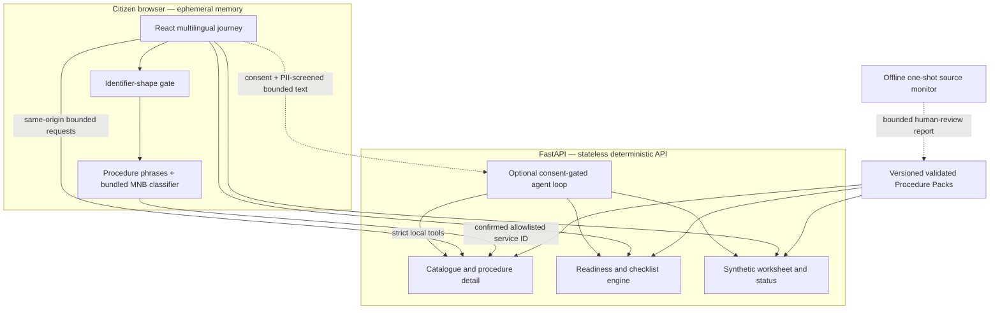

# Architecture

Sahayi is a same-origin React/TypeScript and FastAPI application with four deliberately separate trust boundaries.

## Browser-local inference

The service finder receives the narrow active catalogue in the selected locale, but raw finder text never enters a URL or API request. It blocks obvious Aadhaar-, Indian-phone-, email-, and numbered-address-shaped input, then combines:

- a deterministic locale-specific scorer over pack-authored intent phrases; and
- a bundled character 2–5-gram Multinomial Naive Bayes classifier trained offline on owned synthetic data.

The model is imported at build time and embedded in the compiled frontend. Inference is synchronous TypeScript with bounded input/features and no model request, browser LLM, WebGPU, WASM, or generation. Agreement, one-sided confidence, disagreement, unsupported, abstention, and invalid-artifact cases follow explicit confirmation/fallback rules. Only an active catalogue ID can be proposed, and every proposal requires confirmation.

## Deterministic backend

FastAPI loads Procedure Pack v1 JSON through strict Pydantic models. Exactly one active version per service is allowed; missing packs, duplicate active versions, invalid rules/translations/references, or unsafe budgets fail closed. Canonical pack digests provide reproducible traceability, not signature-based authenticity.

The server exposes versioned `/api/v1` endpoints for health/public configuration, catalogue/detail, readiness, checklists, synthetic form assistance, synthetic submission/status, and the optional assistant. Procedure/readiness APIs are stateless, accept only bounded schema-validated values, and return `Cache-Control: no-store`. Stable facts, rules, options, source URLs, and outcomes are language invariant; locale selects reviewed static text only.

Readiness evaluates a bounded JSON AST rather than executable expressions. Checklists, worksheets, and simulated status are reconstructed from validated pack IDs and deterministic functions. “Readiness” is procedural guidance—not eligibility, approval, legal advice, submission, or government status.

## Optional OpenAI boundary

`POST /api/v1/assistant/turn` is the only cloud-AI route. It is unavailable unless both `SAHAYI_AGENT_ENABLED=true` and a server-only `OPENAI_API_KEY` are present. The browser requires affirmative consent, and browser/backend gates reject common identifier shapes before a provider call.

The server uses a bounded Responses API loop with a fixed allowlisted model, low reasoning, strict tools/structured output, `store: false`, no streaming/retry, short timeout, process-local concurrency/rate/request limits, and limited history/rounds/output. The model may guide phrasing and tool order, but the server rebuilds factual cards, actions, sources, fees, readiness results, worksheets, and simulated status from deterministic local functions. Provider errors and malformed output fail back to deterministic guidance. `store: false` is not a Zero Data Retention guarantee.

## Procedure intelligence and simulation

Active sources may declare bounded monitoring metadata. The monitoring CLI is offline-first and one-shot; live public retrieval requires two explicit flags and exact pack allowlists. It cannot publish packs, edit facts, resolve conflicts, or run from hosted routes. A changed or missing baseline requires human review while the last reviewed pack stays active.

Worksheets and submission/status flows use allowlisted fictional personas, closed choices, watermarks, and `DEMO-...` references. They do not fill an official form, create a server file, contact a government system, or track an application.

## Runtime and deployment

Development uses Vite at `127.0.0.1:5173` and FastAPI at `127.0.0.1:8000`, with one exact configured CORS origin. The multi-stage Docker build compiles the frontend, installs the Python package, and copies the compiled assets and active packs into one final image. The container runs as UID/GID 10001, binds Render's `PORT` (local fallback `10000`), and uses FastAPI to serve both the SPA and API.

There is no citizen database, disk, worker, cron job, hosted source fetcher, analytics system, or telemetry pipeline. Render auto-deploy is disabled. See [Privacy and safety](privacy-boundary.md), [Procedure Packs](../procedure-packs/README.md), [the model card](intent-model-card.md), and [deployment](../.ai/DEPLOYMENT.md).
